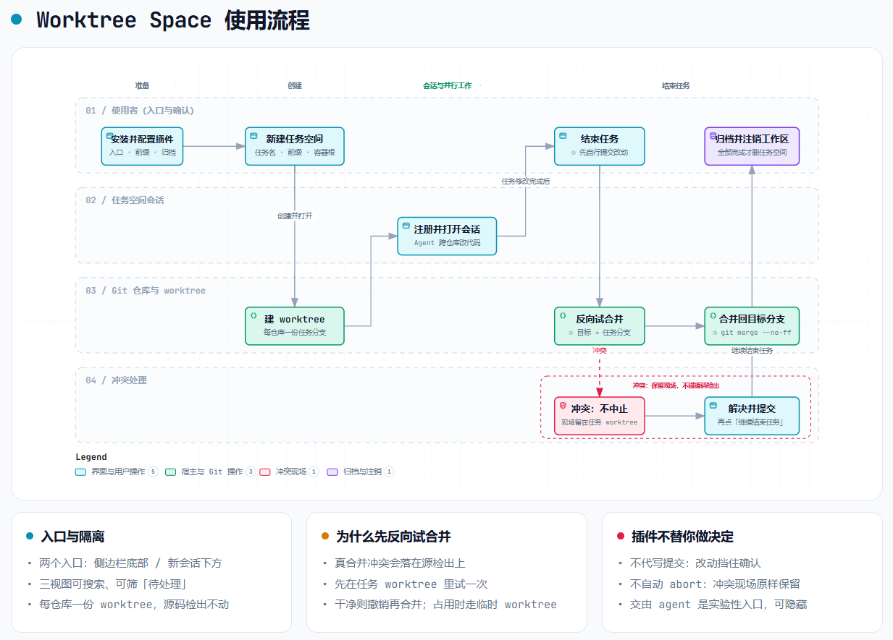
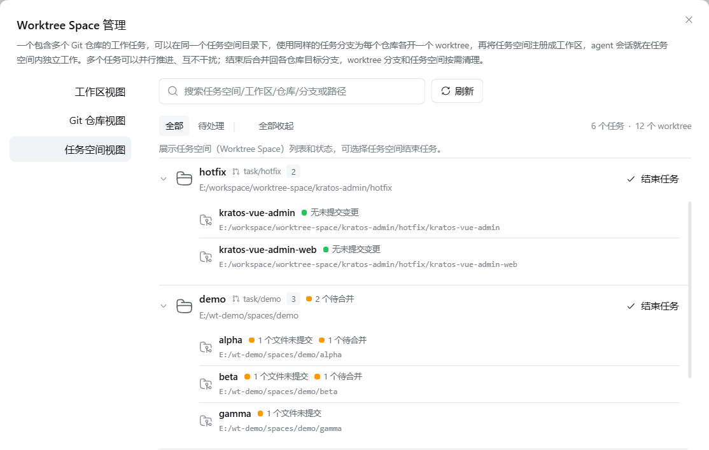
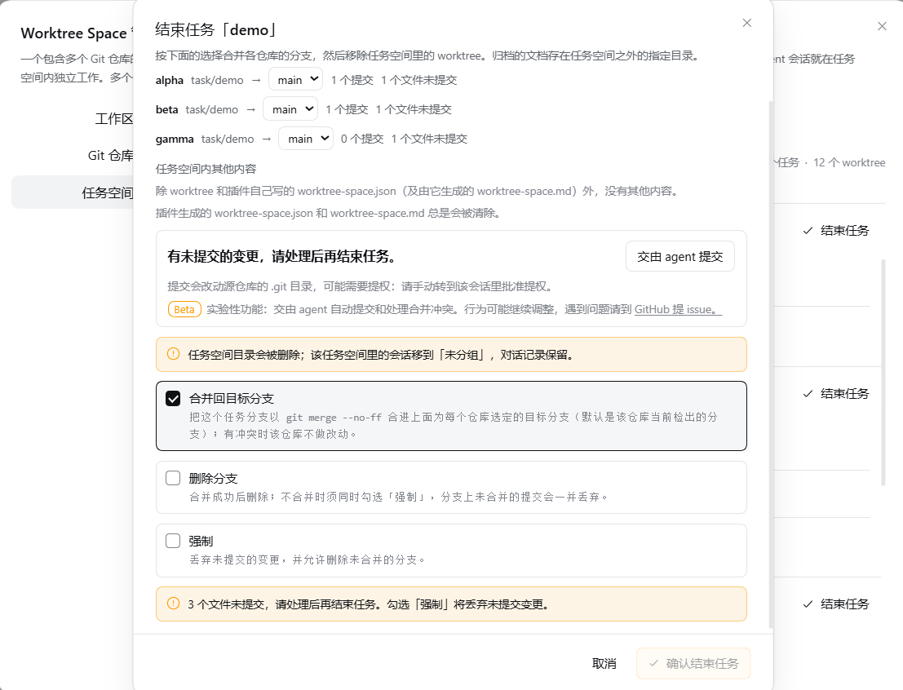

# Worktree Space

[简体中文](README.md) · **English** · [Changelog](CHANGELOG.en.md)

Worktree Space: One task, one space — work on parallel tracks. A task that involves one or more Git repositories goes into its own task space directory, where each
participating repository gets a worktree on one shared task branch; the task space registers itself as a DSH
workspace, agent sessions start working inside it, and each task gets its own space, so several tasks can run in
parallel without interfering with one another. When a task is finished you can merge the task branch back into the
target branch, remove the worktrees, and file whatever documents were left in the task space into a directory you
choose; you can also hand the uncommitted commits and merge conflicts to an agent.




> [!IMPORTANT]
> **Beta (experimental)**: handing the commits and the merge conflicts to an agent is a feature
> in an experimental validation phase and is **shown by default** - set the plugin's agent handoff
> entry to hide to take those two entries off the finish dialog; its behaviour may still change
> (see the [experimental section](#-experimental-handing-the-commits-and-the-conflicts-to-an-agent)).
> The rest of this document describes the flow
> without an agent. Please report problems in
> [GitHub Issues](https://github.com/kangtsang/dsh-worktree-space/issues).

## 📑 Contents

- [🚀 Install](#-install)
- [✨ Features](#-features)
- [📂 Layout of a task](#-layout-of-a-task)
- [🔧 Requirements](#-requirements)
- [🔐 Permissions and failure boundaries](#-permissions-and-failure-boundaries)
- [🛠️ Usage](#-usage)　[⚙️ Configuration](#-configuration) · [➕ Create](#-create-a-worktree-space) · [🗂️ Manage](#-manage-a-worktree-space) · [🏁 Finish](#-finish-a-worktree-space)　[Each combination](#what-each-combination-does)
- [🤖 Experimental: handing the commits and the conflicts to an agent](#-experimental-handing-the-commits-and-the-conflicts-to-an-agent)　[The two buttons](#the-two-buttons-and-what-they-do) · [The flow](#the-flow-and-its-steps)
- [📝 The operation log](#-the-operation-log)
- [📄 Companion documents](#-companion-documents)

## 🚀 Install

**On the web client, from the command line:**

```sh
dsh plugin --profile web add dsh-worktree-space
```

To uninstall: `dsh plugin --profile web remove dsh-worktree-space`. To update, remove and reinstall.

**On the desktop client, from the plugin management page:** sidebar → **Plugins**, put
`dsh-worktree-space` in **Plugin package name**, and press **Install**; to remove it, open
**Worktree Space** from the list, go to its **Plugin details** page, and press **Uninstall** at the
top right.

## ✨ Features

- **Create a task from a session.** Pick a source root, name the task, choose the branch prefix,
  tick the repositories to take part, and say where the task space goes. Every repository gets a
  worktree on `<branch prefix><task>` — `task/<task>` by default — starting from each repository's
  current HEAD, or from a named branch or commit.
  The bottom of **Task details** holds the **delivery policy**: what to deploy to and when, who
  verifies the work, how a merge happens, which branch it lands on, whether the branch is deleted
  afterwards, what an unresolved conflict does, and what happens to the files a task space leaves
  behind — eight choices, two to a row, every one a dropdown, **starting at the plugin's default
  policy** (the answer when nothing is said); each name carries a **question mark whose hover shows
  what that choice means**. What you pick travels with the create request, is written into the task's
  own record, and **beats that project's stored default**.
  **Merge into**, **Branch after merge**, **Conflicts** and **Leftovers** **appear only once Merge is
  "merge by itself"**: with "only when a merge is asked for" the finish is the user's own press, and all
  four of those — leftovers included — are put to them at that moment. Only a finish the flow runs by
  itself needs them settled here first.
  The plugin's default for **Leftovers** is **Archived**: a finish copies them into the archive directory
  (by default `<container root>/archived-docs/…`) instead of leaving them in the space for a second
  finish, and instead of deleting them; pick "left alone" in that box if nothing should be moved.
  For "merge back by itself when it is done", pick **Merge by itself** and **The agent alone**: those
  two are a pair — merge-by-itself with a verification that waits for a person is refused, and the
  refusal says what to change.
- **Registered as a Workspace** named `<parent>/<task>`, opened with a session whose working
  directory is the task space, so an agent can edit inside the task space without touching the
  source checkouts.
- **A management page**, with three views (both ways in, and their defaults, are described under Manage a Worktree Space):
  - **Workspaces** shows which Workspaces can host a task space, and how many repositories
    each one has;
  - **Git repositories** lists every Git repository found and the worktrees linked to it;
  - **Task spaces** puts each task's repositories together (branch, how many files changed,
    whether it is locked or prunable).

  All three can be searched, and **Needs attention** narrows them to rows worth a look
  (changes, a lock, something prunable, or a status that failed to read). The arrow on a row
  folds that row on its own; the button beside the filters folds or opens them all at once.
- **Add a repository to a task** from its row, when the work turns out to need one the task
  did not start with. The candidates are the Git repository view's own list, minus the ones the
  task already has; a repository directory can also be typed in, and it is registered as a
  Workspace so it joins that view too. The new repository gets a worktree on the branch the
  task is already on, starting from its own HEAD or from a branch or commit you name.
  An added repository may share no common directory with the ones the task began with, and may
  not even be on the same volume: merging and finishing are unaffected, because each repository's
  source is read from its own worktree. What it does affect is the working directory of a session
  handed the commit — it cannot reach those source repositories' `.git`, so the elevation is
  approved in that session. This release does **not** offer removing a repository from a task.
- **Finish a task** from its row: each repository's branch is merged back into its target branch,
  the worktrees are removed, the task space's documents are filed under a selected directory,
  and the Workspace registration is removed — but not while a session in that Workspace is still
  running. Where the merge runs and what a conflict means: see Finish a Worktree Space.
- **Finish task space** also sits in that workspace list's own `⋯` menu, for directories that
  really are task spaces.
- **New task space** is in that same `⋯` menu, for Workspaces that hold repositories, and
  opens the one create dialog.
- **The interface is fully bilingual in Chinese and English.** The management page, the create and
  finish dialogs, the configuration items and their explanations, the buttons and the error messages
  all switch with DSH's language setting; the plugin registers `zh` and `en` with the host (214 strings
  each) and carries no language switch of its own. The plugin list's name, description and icon are
  English only.
- **No extra service needed.** The two entries, the scan depth and the directory limit all
  live in the plugin's own configuration (see Configuration). It follows DSH themes.
- **An operation log, on by default and switchable.** `worktree-space-log.jsonl` at the container root
  records what this task space did; reading it is how a report gets reproduced. See
  [The operation log](#-the-operation-log).

## 📂 Layout of a task

> Terms: the **Worktree Space container** (the **container** below) is the directory the plugin keeps
> task spaces in — that is, the **container root directory** `worktree-space/`. Each paragraph names
> it in full the first time and in short after.
>
> **Container root** is short for **container root directory** and points at that one directory: both
> the area it occupies and the path you fill into the setting.

```text
~/workspace/                            the root workspace: projects hang off this level, and the Worktree Space container root lives here too
├── repo-x/                             project x's main Workspace (a repository itself)
├── project1/                           project 1's main Workspace (several repositories)
│   ├── repo-a/
│   └── repo-b/
├── deep-path/project2/                 project 2's main Workspace, filed under a deeper directory
│   ├── repo-c/
│   └── repo-d/
└── worktree-space/                     the container root: the plugin's own zone
    ├── repo-x/                         the project layer, named after the source Workspace directory
    │   └── task-x/                     the task space — also the session's working directory
    │       ├── worktree-space.json     the task's record: branch, base, project, repositories, created
    │       ├── worktree-space.md       rendered from that record — branch, base and conventions
    │       └── repo-x/                 a worktree on <branch prefix>task-x
    ├── project1/
    │   ├── hotfix/
    │   │   ├── repo-a/                 both on a worktree named <branch prefix>hotfix
    │   │   └── repo-b/
    │   └── task-a/
    │       ├── repo-a/
    │       └── repo-b/
    ├── project2/                       filed under a deeper directory, and still the same container
    │   └── task-b/
    │       ├── repo-c/
    │       └── repo-d/
    ├── archived-docs/                  the archive root (default): non-Git output lands here
    │   └── project1/                   filed by project
    │       └── hotfix-20260926-020933/   `<task>-<YYYYMMDD-HHMMSS>`, one folder per task
    ├── README.md                       written once, on first use: this is the worktree-only area
    └── worktree-space-log.jsonl        the operation log: every git call, error and warning

~/my-archive/                           an archive root, chosen in the plugin's settings
└── project2/                           same shape: a project layer, then a task name with its timestamp
    └── task-b-20260926-020933/
```

The **Worktree Space container root** is recommended **one level below the root workspace** (`~/workspace/worktree-space`),
and where that is depends only on the first directory below the volume root: `~/workspace/project1` and
`~/workspace/deep-path/project2` are both offered the **same** container however deep their own project
sits. A different path can be given when a task space is created.

The project name is the **source Workspace's directory name**; the plugin layers by itself, so there is
nothing to fill in. Two projects in one Worktree Space container can each hold a task called `hotfix` without crowding
each other. When the Workspace directory *is* a repository (`~/workspace/repo-x`), the project and
repository layers end up with the same name — `repo-x/task-x/repo-x`. That repeat is deliberate: the
layout is three levels deep either way, so neither the plugin nor the client needs to be told which
level is which.

The **Worktree Space container root** is the plugin's zone: the first task space created under it writes a `README.md`
saying this is a worktree-only area and that `git init` / `clone` do not belong there (an existing one is
never overwritten). Conversely, if the container root is itself a Git repository — it has a `.git` —
creation is **refused**, and not a single directory is made.

The archive root splits two levels further, `<project>/<task>-<YYYYMMDD-HHMMSS>/`, so its shape mirrors the
Worktree Space container's and a project's documents stay in that project's own folder. By default it sits in the
container root, adding exactly one directory — `archived-docs` — and the operation log's one file to the
whole volume. See [The operation log](#-the-operation-log).

## 🔧 Requirements

- [Node.js](https://nodejs.org) `>=22.19.0`
- [Git](https://git-scm.com): it runs every worktree and branch operation, is not shipped with the
  plugin, and has to be on `PATH`
- DSH `>=0.1.7-rc.1 <0.3.0-0`, the 0.1.7 line without its `0.1.7-alpha.x` prereleases, and 0.2.x
- Clients: **both the web client and the desktop client work**; the desktop client was verified by
  hand, the command-line matrix does not cover it

**All four official releases were verified one by one** — `0.1.7-rc.1`, `0.1.7-rc.2`, `0.2.0-rc.1`
and `0.2.0-rc.2` — each against **its own** DSH CLI, in a disposable profile, through
install, start, uninstall and rollback. That matrix covers the **command line and the web client**;
the desktop client (Electron) was only confirmed installable by hand and is not part of the scripted
matrix. The per-release record is in
[`docs/store-evidence.md`](docs/store-evidence.md).

DSH **enforces** the DSH range declared in the manifest's `peerDependencies`: a runtime that does not
satisfy it has the install refused before pnpm runs, or the plugin refused at startup, with the
exact-version exemption (`dsh plugin allow-version`) offered instead. Fields such as `engines.dsh` are
declarations and block nothing. Anything outside the tested range is treated as unknown rather than
passed off as evidence; if you hit a version-specific problem, open an
[issue](https://github.com/kangtsang/dsh-worktree-space/issues).

## 🔐 Permissions and failure boundaries

At runtime this plugin reads and writes files and runs `git`. Those two permissions *are* its
function; they cannot be reduced to zero. Every runtime dependency is supplied by the DSH profile and
none of them ship with the plugin — installing it brings in no new runtime third-party dependency,
contacts no external service and reports no telemetry.

**Permissions at a glance:**

| Permission | Scope |
| --- | --- |
| File reads | The selected Workspace directories (breadth-first scan, skipping `node_modules`, `dist`, `build`, `vendor` and hidden directories except `.worktrees`); the record files in the task space and at the Worktree Space container root; each worktree's `.git` marker file; and, at finish, the contents of the files git lists, read only to decide whether a merge still carries conflict markers |
| File writes | Only inside the task space, the Worktree Space container root, and the archive directory the configuration names (see Configuration); finishing a task removes only the worktrees and documents the plugin itself created, and a merge also `git worktree add`s one temporary checkout under the **system temporary directory** and deletes it right after. It does **not** write the files of a source repository's checkout and does **not** write the DSH data directory |
| Command execution | `git` only, always as `git -C <dir> <subcommand>` with fixed argv through a single `runGit` seam — no shell. **`add` and `commit` are not among them**: the plugin writes no commit, uncommitted work stops that repository (see below), and a commit handed to an agent is run by the host's own session |
| Operation log | `worktree-space-log.jsonl` at the container root, **on by default**: the git commands that change repository state, any git command that fails, the outcome of every operation, and every error and warning with an error code. Switchable in the plugin settings; switching it off leaves any log already there alone. **No file contents**, credentials in a URL masked before the write; nothing sends it anywhere and it leaves this machine |
| Network | None: the plugin itself makes no HTTP requests and runs no `git push`; every `git` subcommand it runs is local |
| Credentials | Reads, stores and forwards none; the plugin never touches keys |
| Global resources | No global installs, no daemon or resident service, no writes to system directories |

The full account — what it reads, what it writes, which subcommands it runs and what happens when
things fail — is in [PERMISSIONS.en.md](PERMISSIONS.en.md); the disposable-Profile install, start,
uninstall and rollback acceptance evidence is in [docs/store-evidence.md](docs/store-evidence.md).

**Failure boundaries (never silent):**

| Situation | Behaviour |
| --- | --- |
| Directory scan hits its limit | Throws with `Worktree scan limit reached; choose a more specific Workspace.` — pick a narrower Workspace |
| Any `git` command fails | Throws `git <args> failed (exit N): <stderr>`, surfacing Git's own diagnosis verbatim |
| A repository still holds uncommitted work at finish | That repository stops (`force` is what discards it): `uncommitted work is waiting in <worktree>; commit it before the task can be finished`; the plugin **writes no commit**, the others carry on, and the result names each one |
| A merge is resolved but not committed | `the merge in <worktree> is resolved but not committed` — the state is kept as it stands |
| The resolved files still carry conflict markers | `the resolved merge still has conflict markers in <files>` — kept as they stand, no side is taken |
| The rehearsal merge conflicts | Does **not** auto `merge --abort`; the merge site is kept (with `mergeSite` and `conflictedFiles`) until it is resolved and committed, then carry on |
| The real merge meets a fresh commit | The rehearsal passed, then the real merge ran into a commit someone pushed in between: the merge is undone (`merge --abort`, the branch is left as it was) and Git's own words are surfaced; the worktree and the task branch are kept, and pressing **Continue finishing** rehearses again |
| Worktree removal fails | Reports `failed to remove the worktree (uncommitted changes? force it deliberately)`; the worktree is kept and reported, and `git worktree prune` is the remedy |
| A task directory is not empty | The directory and the Workspace registration are kept rather than force-deleted |
| A fact cannot be confirmed | It is written as "unknown" — absence of evidence is never inferred as absence of access |

## 🛠️ Usage

### ⚙️ Configuration

**In the UI** (recommended): sidebar → **Plugins** → **Worktree Space** → the configuration
section of its **Plugin details** page, beside every other plugin's; changes take effect
immediately, no restart. The file can also be
edited directly: the plugin's `config:` block in `profiles/<profile>/cordis.patch.yml` under the DSH
data directory, which needs a DSH restart.

| Setting | Values | Default | Meaning |
| --- | --- | --- | --- |
| Panel entry (under New session) | show / hide | **hide** | The row in the sidebar's panel list that opens the management page full-width (the page brings its own left-hand navigation and its Back to conversation); hidden by default |
| Shortcut in the sidebar footer | show / hide | show | The shortcut at the sidebar foot, opening that same page as a **dialog** |
| Agent handoff entry (experimental) | show / hide | show | The finish dialog's two experimental entries, **Hand the commits to the agent** and **Hand the conflict to the agent**; hidden, the standard flow applies: commit and resolve the conflict yourself, then continue the finish |
| Scan depth | 1–5 levels | 3 levels | How many levels below a Workspace directory (level 0) the scan looks for Git repositories |
| Scan directory limit | 500 / 1000 / 2000 / 3000 / 5000 / 10000 | 2000 | How many directories one scan may read; past it, a smaller Workspace is requested |
| Directories the scan skips | any list of directory names | the plugin's 25 | A scan never descends into directories with these names. The plugin ships 25: dependency and build-output directories across languages — `node_modules`, `target`, `__pycache__`, `Pods` and the rest — plus this plugin's own task container, under both names it takes, `worktree-space` and `dsh-worktree-space`. You can add your own or take one of those away. **Removing a built-in one asks first**, because the cost lands on the next scan rather than in the dialog. Up to 200 of your own. Names are matched without regard to case; the Edit button on the right opens a dialog to search, add and remove, and nothing is written until it is saved |
| Default branch prefix | any text | `task/` | The prefix a new task space starts from; changing it in the create dialog and ticking Set as the default branch prefix writes it back here when the space is created |
| Worktree Space container root | default / custom directory | **default** | Where new task spaces go. **The default is the recommended choice**: it is derived from the source Workspace by the rule below and lands one level below the root workspace, so every project under that root workspace falls into the same container however deep its own directory sits, and their tasks cannot crowd each other. A custom directory that shares no common ancestor with the project's directory makes the session that hands commits and conflicts to an agent ask for authorisation by hand |
| Custom Worktree Space container root | any path | empty | Used only by the custom strategy; empty keeps the derived recommendation. Changing the Worktree Space container root in the create dialog and ticking Set as the default Worktree Space container root writes both back when the space is created |
| Archive documents location | in the container root / custom directory | **in the container root** | The root the archive is filed under; both strategies add a `<project>/<task>-<YYYYMMDD-HHMMSS>` folder beneath it, the stamp being the local time of that moment, to the second. The default files them in the Worktree Space container root's own `archived-docs`, wherever the task space was made |
| Custom archive directory | any path | empty | Used only by the custom strategy; empty files them in the Worktree Space container root's `archived-docs` |

A scan covers **every** Workspace. It goes breadth-first, reading up to eight directories at
a time per level. Any directory holding `.git` counts as a repository; `node_modules`,
`dist`, `build`, `vendor` and hidden directories are skipped (except `.worktrees`).

### ➕ Create a Worktree Space


> Terms: the **source root** is the Workspace directory handed to the plugin — a repository itself, or a directory
> whose top-level children are repositories; the **source tree** is that directory and everything under it. The
> create dialog calls it the "repositories' directory".

1. In a session, click **New Worktree Space** above the composer.
2. Name the task — it is lower-cased, and spaces, Chinese and other characters become dashes
   (`hotfix-placeorder`); an invalid name is reported with the rule it breaks.
3. Set the **branch prefix** when a different one is needed. The branch is this prefix plus the task
   name, and an empty field falls back to the configured default (`task/` unless you changed it).
   The line under the field always names the default it would use. Tick **Set as the default
   branch prefix** — offered only when the entered prefix differs from the configured default —
   to write it back to the plugin's settings when the space is created.
4. Say where the task space goes — the **Worktree Space container root**. It has to sit beside the
   **repositories' directory**: not inside it, and not above it. A recommended path is
   pre-filled — `worktree-space` **one level below the root workspace** — and rarely needs
   changing. Another location also works: **Set as the default Worktree Space container
   root** then appears under the field; ticking it writes that path back to the plugin's
   settings when the space is created, and the note below it states what that choice costs.
   For how the recommendation is worked out and what the container holds, see Layout of a
   task.
5. Tick the repositories the task should take part in — each card names the branch its HEAD is on — and
   choose the branch base.
6. Click **Create and open**. The new Workspace opens a session whose working directory is the
   task space.

If the task space is built but registering the Workspace fails, the dialog says why and
allows the registration to be retried.

### 🗂️ Manage a Worktree Space



Open the **management page** — two ways in:

- **The Worktree Space shortcut at the sidebar foot** (shown by default) — opens it as a **dialog**;
- **The Worktree Space row under New session** (hidden by default, turn it on in the
  **configuration**) — opens it **full width** in the main column.

Both forms share one left-hand navigation: the full-width page leads with **Back to conversation**,
since the panel takes the column the conversation was in, then the three views; at the foot of the
column, **⚙ Plugin Settings** jumps to this plugin's configuration on the Host's Plugins page.

The three
views differ as described under Features: Workspaces shows where a task space can start, Git
repositories shows every Git project found and its worktrees, Task spaces shows each task and its
repositories. The summary on the right follows the view (`N tasks` / `N Workspaces` /
`N repositories · M Worktrees`), and reads `shown / total` while a search or filter is
narrowing the list.

The panel rescans every time it is opened, but it first paints what the Host still remembers
of the previous scan, so it shows data straight away and swaps in the fresh result when the
scan lands (`Scanning every Workspace…` marks the wait). That memory lives in the DSH instance's own
process only: nothing is written to disk, and it is gone when the instance exits.

### 🏁 Finish a Worktree Space



Use **Finish task** on the task row, or **Finish task space** in the workspace list's `⋯` menu.
The dialog spells out what is about to happen — uncommitted files, commits to merge, the
branch to merge into, and the task space's own documents (the archive option only appears
when there is something to archive). Merging back is selected by default; deleting the
branch and forcing are not.

Finishing a task space is one standard path, in three steps:

**1. The commits are yours to make; this plugin never writes one.** While the plan shows
uncommitted changes in a repository and **Force** is not ticked, **Finish task** stays
unavailable — those changes are not this side's to write, and a worktree will not go while it
holds them. The plan names those repositories and how many changes each one holds. Commit them in
each worktree with `git add` and `git commit` (the message is written by the user); afterwards
are done, close the dialog and open it again — it re-reads the plan every time it opens, and those
repositories stop holding **Finish task** back. **Force** may also be ticked, which discards
those changes with the worktree. When the work is not to be done by hand,
yourself, **Hand the commits to the agent** hands it to an agent session (see the experimental
section at the end). A worktree in the middle of an unfinished merge does not take this step; that
one is step 3's.

**2. Merge: rehearse the other way round, then merge for real.** The merge itself puts **the task
branch into the target branch** (by default the branch the source repository has checked out), and
it lands in the **source repository**. Before the target is touched, the target is merged into the
task branch **inside the task space's own worktree** — the opposite direction. Two outcomes:

- **Clean**: that rehearsal is undone again (the worktree goes back to where it started), and the
  task branch is then merged into the target branch with `--no-ff` as usual, so the target keeps
  an ordinary merge commit. A target that is not checked out anywhere is merged in a temporary
  worktree that is discarded afterwards, leaving the source checkout alone.
- **Conflicted**: that merge is **not aborted and not reverted** — the rehearsal simply stays
  where it stands, in the task branch's worktree, which keeps its `MERGE_HEAD` and the conflicted
  files with their markers sitting in its working tree (for instance
  `~/workspace/worktree-space/project1/hotfix/repo-a/src/app.ts`). The **target branch is
  untouched**, and so is the source repository's checkout.

Why rehearse the other way round: a conflict in the real merge lands in the source repository and
its checkout, and it would have to be aborted, with a side picked by hand. Rehearsing first puts
the conflict in the plugin's own checkout — the task branch's worktree — which is exactly where the
work can be dealt with in place, without touching the source checkout.

**3. A conflict stops the finish and waits for the user to resolve it on the spot.** As soon as one
repository stands on a conflict the whole finish is partial (`failed: true`, the Worktree Space container stays,
and the other repositories may already be merged and removed). Every repository row reports
`mergeInProgress`, `mergeSite` (the directory the conflict stands in) and `conflictedFiles`. The
dialog then shows **A merge conflicted: deal with it, then finish the task again.**; the way on is
**Continue finishing** at the foot of the panel.

The site is the task branch's own worktree (for instance `~/workspace/worktree-space/project1/hotfix/repo-a`), standing
in an unfinished merge. Resolve the conflict there, `git add`, and one `git commit` that says how
the two sides are reconciled concludes the merge — the target branch and the source repository's
checkout were never touched; the commit has to land on that worktree, whose index lives under the
source repository's `.git/worktrees/<name>/`. To have an agent resolve this conflict instead, use
**Hand the conflict to the agent** (see the [experimental section](#-experimental-handing-the-commits-and-the-conflicts-to-an-agent)).

**Continue finishing** then runs the same judgement again: if the target branch is already inside
the task branch, the rehearsal is skipped and the real merge goes ahead; otherwise it is rehearsed
once more and a conflict stands where it stood before, for the user to resolve again.

If the site still holds a resolution nobody committed, or conflict markers are still in the files,
the plugin does not commit it: the site is left exactly as it stands and the outcome goes
back to the user — fix it and press **Continue finishing** again.

Deleting a branch normally needs the merge: deselect the merge and the branch option goes
with it. To abandon a task space instead of finishing it — nothing merged, the branches and
the commits on them discarded — select **Force** as well, which is what allows deleting a
branch that was never merged; abandoning is also the one combination that skips the commit
in step 1.

#### What each combination does

| Merge back | Delete branch | Force | What happens |
| --- | --- | --- | --- |
| ✓ | | | **Finish task** is unavailable at first: commit each worktree's uncommitted changes to its own task branch (until this is done, the finish stays on that step and names the worktree — `uncommitted work is waiting in <path>` in that row's `error`), and its branch is then merged into the target chosen on its own row (by default the branch that repository has checked out) with `--no-ff`; the worktrees are removed; **the branches stay**. A repository standing on a conflict keeps its place, the others still finish |
| ✓ | ✓ | | The same, and the branch is deleted once merged (`git branch -d`, so an unmerged branch cannot be deleted this way) |
| ✓ | | ✓ | Merging still happens, but Force skips the commit: uncommitted changes in the worktree are **discarded with it**, and the plugin does not commit them; the branches stay |
| ✓ | ✓ | ✓ | Merge and force-delete the branch (`git branch -D`); the branch was merged, so nothing extra is lost |
| | | | Nothing is merged: **Finish task** is unavailable until the changes are committed (they stay on the branch that stays), the worktrees and the task space go, **the branches stay** to be merged by hand |
| | | ✓ | The same, without the commit: uncommitted changes are **discarded with the worktree**; the branches stay |
| | ✓ | ✓ | **Abandon**: nothing merged and nothing committed, the branch force-deleted, and **the commits it held are discarded along with the uncommitted changes in the worktree** |

Whichever combination is chosen, three things do not change:

1. **The metadata is always cleared.** The two records the plugin itself generates in the task
   space — `worktree-space.json` and the `worktree-space.md` rendered from it — go every time. An
   older space may still hold a `README.en.md`, which is cleared too, or a `README.md` this plugin
   wrote back then; that one is left alone rather than assumed to be ours.
2. **Everything else follows the archive choice.** Unselected, it is discarded outright.
3. **Repositories that did not finish are kept as they are.** **A repository whose work nobody
   committed, or whose merge stands on a conflict, is kept as it is and reported as unfinished**
   while the others finish, which is also why the task space directory and its workspace
   registration stay.

The directory and the registration are removed only once every repository really went and the task
space holds no worktree any more, and its sessions then fall back to Ungrouped with their
transcripts intact.

The **Finish task** button follows the same reasoning: **amber** is an ordinary finish (the
merge can be reverted and nothing is discarded), and it is **red** only where the dialog can
name what will be lost — abandoning the task space (no merge, force-deleting the branches)
while a worktree still holds uncommitted files, or while a branch still holds commits that
were never merged.

## 🤖 Experimental: handing the commits and the conflicts to an agent

What this section describes is **shown by default**: set the plugin's agent handoff entry to hide to
take those two entries off the finish dialog. Hidden, the finish takes the standard route - the
plugin writes nobody's commit and picks no side of a conflict. It stops and says where things stand
instead: uncommitted work is yours to commit in each worktree, and a resolved conflict is committed
and then carried on with **Continue finishing**, which is what the line under the panel says.

When finishing a task, the plugin can open a DSH agent session to do two jobs: commit the
uncommitted changes, and resolve a merge that stands on a conflict.

### The two buttons and what they do

- Repositories with uncommitted changes in the plan → **Hand the commits to the agent**: it opens a
  session that `git add`s those changes and commits them, with a message saying what changed and why
  (in the language and style that repository's own commits use).
- A repository standing on a merge conflict → **Hand the conflict to the agent**: it opens a
  session that reads both sides, works out what each was after, writes a version that keeps both
  intentions, and concludes the merge itself (`git add`, then `git commit` with a message saying how
  the two sides were reconciled).

Both jobs ask the same: do not push, do not touch other repositories or the task space, and do not
merge a branch back into its target — that step is the plugin's.

Those repositories share one session (in the conflict step, a repository that already has the session
step 1 opened reuses it). The working directory is the common ancestor of their boundaries: a
repository's own boundary is its worktree, or, when the Host named the main checkout's path, the
common ancestor of that worktree and the main checkout. Where that common ancestor falls back to the
**volume root** (the repositories sit on different volumes, or both the task space and the
repositories sit directly under the root) there is still just the one session, working in the **task
space**, and the elevation is yours to approve in that session.

### Putting those sessions in one group (off by default)

That working directory is decided by the layout rather than by the plugin, so those sessions only land in
a Workspace that happens to sit exactly there — and in the sidebar's Ungrouped where none does. DSH computes
its groups from each session's working directory, so the only way to collect them into one group is to make
that group's path the working directory.

**Full access for the sessions handed to the agent for conflicts and commits** (off by **default**) is that. Turned on:

- both sessions open at the **container root**, so they belong to the Workspace the plugin registered for
  it (the container root's two names, `worktree-space` and `dsh-worktree-space`, also joined the built-in
  ignored scan directories, so a scan no longer walks in looking for repositories);
- right after the session exists, the plugin puts its sandbox mode at `danger-full-access` — the container
  root does not reach a source repository's `.git`, and the commit has to write there.

Be clear about the cost: **that session may then write anywhere the DSH process can write**, and stops
asking. The grant is recorded in the session log, so it survives a restart. That is why it is off. The card
that offers the handoff in the finish dialog shows the state and can change it, and says so plainly: it
**applies to the sessions opened after this**; one already open is switched in its own session with
`/permission`. A host that serves no configuration form shows the state there without the switch.

### The flow and its steps

1. With uncommitted changes in the plan, press **Hand the commits to the agent**: the plugin opens a
   session and hands the job over. Ticking **Force** skips this step and opens no session at all.
2. Wait for the session to stop. Once it does, the plugin re-reads the plan once (once per job, and a
   session seen running re-arms that read).
3. When the plan that comes back holds no uncommitted files in those repositories, the headline turns
   into a **green status light** with green text: in the commit step "The commits are done: carry on
   and finish the task.", in the conflict step "The conflict is resolved: carry on and finish the
   task."
4. Press **Finish task** or **Continue finishing** to carry on.
5. When a merge stands on a conflict, press **Hand the conflict to the agent** and repeat steps
   2-4.
6. An agent that only edited the files without committing (or left conflict markers behind) gets no
   commit from this side: the site is left exactly as it stands, the result says it did not finish,
   and it is wrapped up or taken over by hand before pressing **Continue finishing**.
7. The rehearsal in step 3: once the agent has merged the target branch into the task branch and
   committed it, pressing **Continue finishing** usually answers "yes" to whether the target branch is
   already contained in the task branch, and the rehearsal is skipped; only when somebody has pushed
   to the target branch again does it run once more first.

**Finish task** or **Continue finishing** at the foot of the panel only ever runs once the user has
confirmed it.

## 📝 The operation log

A `worktree-space-log.jsonl` sits at the container root, **on by default**, recording every step this
task space has been through:

- **git commands that change repository state**, and **any git command that fails** - including a read
  that fails. A successful read is not recorded, or the file would be nothing but the echo of `git status`.
- **The outcome of every operation**: whether a create worked, which worktrees a finish removed.
- **Every error and warning the plugin hits**, carrying an error code that points straight at the line in
  the source that went wrong.

**The switch** is in the plugin settings. Turning it off only stops new records being written - **a log
already on disk is left exactly where it is**, because it is often the only account of some piece of
work. Delete the file yourself if you want it gone.

**Nothing is sent anywhere**: it is a file in the container root, and deleting the container root takes
it with it. Failing to write it never affects any operation.

## 📄 Companion documents

| Document | What it covers |
| --- | --- |
| [PERMISSIONS.en.md](PERMISSIONS.en.md) | The full permissions and failure boundaries: what is read, what is written, which `git` subcommands run, and what happens when one fails |
| [docs/store-evidence.md](docs/store-evidence.md) | The disposable-profile install, start, uninstall and rollback acceptance steps, with per-release records |
| [CHANGELOG.en.md](CHANGELOG.en.md) | Release history |
| [GitHub Issues](https://github.com/kangtsang/dsh-worktree-space/issues) | Problem reports |
