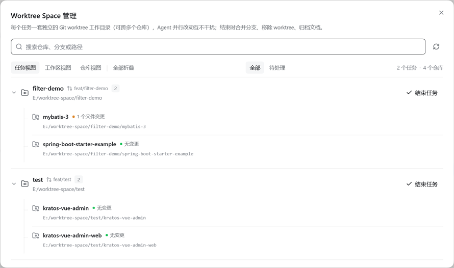
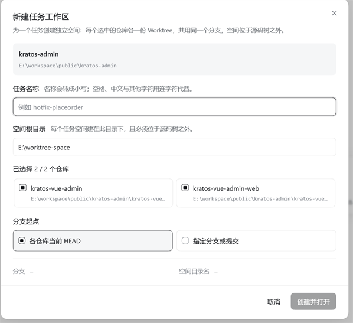

# Worktree Space

DeepSeek Harness 的 Worktree Space 插件：一个任务可以横跨多个仓库，每个仓库用 Git worktree 各开一份，
共用同一个分支，放在源码树之外的任务空间里，并注册成一个 DSH 工作区，自带独立会话。




**简体中文** · [English](README.md)

## 功能

- **从会话里建任务。** 选源码根、给任务起名、勾选要横跨的仓库、指定任务空间放哪。每个仓库都会得到
  一份位于 `<分支前缀>/<任务名>` 的 worktree（前缀默认 `feat/`），起点可以是各仓库当前的 HEAD，
  也可以指定某个分支或提交。
- **注册成工作区**，名字是 `<上级>/<任务名>`，同时开一个会话，工作目录就是这个任务空间 —— Agent 可以
  跨仓库改代码，不会动到源码检出。
- **管理页面**（侧边栏底部的 Worktree Space 入口），分三个视图：
  - **任务视图**：把每个任务下面的仓库列在一起（分支、改动数、是否被锁定、是否可清理）；
  - **工作区视图**：哪些工作区可以建任务空间，以及每个工作区里有几个仓库；
  - **仓库视图**：扫到的每个 Git 仓库，以及它链接的 worktree。

  三个视图都能搜索，也能用「待处理」筛出需要注意的行（有改动、被锁定、可清理，或状态读取失败）；
  每行左边的箭头能单独折叠，筛选旁的按钮可以一次全部展开或折叠。
- **结束任务**：在任务行上点「结束任务」。默认把各仓库的分支合并回主线，删掉 worktree，把任务空间里的
  文档存到 `archived-docs/<工作区名>-<YYYYMMDD-HHMMSS>`（不勾选归档，就会连这些文件一起删掉），
  最后注销这个工作区。要是该工作区里还有会话在跑，会先拒绝，等它结束或停掉再试。
- **结束任务空间**也在这个工作区列表自己的 `⋯` 菜单里 —— 只对确实是任务空间的目录出现。
- **不需要额外服务。** 入口开关、扫描深度和目录上限都在插件自己的配置里改（见「配置」）。支持 DSH
  主题；界面语言跟着 DSH 的语言设置走；插件列表里的名称、描述和图标也由本插件提供。

## 任务目录结构

```text
<任务空间根目录>/
├── <任务名>/                      任务空间 —— 同时是会话的工作目录
│   ├── README.md                  任务的分支、起点与约定
│   ├── <仓库 A>/                  位于 <分支前缀>/<任务名> 的 worktree
│   └── <仓库 B>/                  同名分支的 worktree
└── archived-docs/
    └── <上级>-<任务名>-20260926-020933/    归档文档时存到这里
```

删掉 worktree 不会删除对应的 Git 分支；结束任务会先把分支合并回去，再删 worktree。

## 兼容性

基于 DSH **0.1.7-rc.1** 的客户端契约开发（web profile）。已在 `0.1.7-rc.1` 上验证：宿主 RPC 路由
能注册，客户端 bundle 不用改就能加载，插件列表里的名称、描述、图标和配置区都正常显示。

## 使用

### 安装

**从 npm（推荐）：**

```sh
dsh plugin --profile web add dsh-worktree-space
```

**直接从 GitHub 仓库装：**

```sh
dsh plugin --profile web add github:kangtsang/dsh-worktree-space
```

插件的挂载行写在 profile 的 `cordis.patch.yml` —— 本仓库带着 DSH 的 bundle patch，一般会自动生效；
若插件列表里一直没出现，就手动补上：

```yaml
- id: worktree-space
  name: dsh-worktree-space
  config:
    sidebarEntry: show       # 侧边栏底部的入口
    settingsEntry: hide      # 是否也放进设置面板
    scanDepth: 2
    maxScanDirectories: 1000
```

卸载：`dsh plugin --profile web remove dsh-worktree-space`；更新时先卸载再装一次。

### 配置

在 **侧边栏 → 插件 → Worktree Space** 里改，和其它插件的配置在同一处，改完立刻生效：

| 设置 | 取值 | 默认 | 说明 |
| --- | --- | --- | --- |
| 侧边栏入口 | 显示 / 隐藏 | 显示 | 侧边栏底部的 Worktree Space 入口 |
| 设置面板入口 | 显示 / 隐藏 | 隐藏 | 是否也在设置面板里放一个入口；两个入口互相独立 |
| 扫描深度 | 1–5 层 | 2 层 | 从每个工作区根目录往下扫几层（根目录本身不算） |
| 最大遍历目录数 | 500 / 1000 / 2000 / 3000 / 5000 / 10000 | 1000 | 一次扫描最多读多少个目录；超过会提示你换一个更小的工作区 |

扫描覆盖全部工作区；按广度优先逐层进行，每层最多同时读 8 个目录。任何一层只要发现 `.git` 就认定是
仓库；`node_modules`、`dist`、`build`、`vendor` 等目录和隐藏目录会跳过（`.worktrees` 除外）。

### 创建任务



1. 在会话里，点输入框上方的 **新建 Worktree Space**。
2. 给任务起名 —— 会转成小写，空格、中文和其它字符都换成连字符（`hotfix-placeorder`）；名字不合法时
   会告诉你哪里不合规。
3. 设置任务空间放哪。必须在源码树之外，界面会填好推荐的路径。
4. 勾选任务要横跨的仓库，并选择分支起点。
5. 点 **创建并打开**。新工作区会直接开一个会话，工作目录就是任务空间。

如果任务空间已经建好、但工作区注册失败，对话框会说明原因，并让你重试注册。

### 管理任务

打开 **管理页面**（侧边栏底部的 Worktree Space 入口）。三个视图的区别见「功能」一节：任务视图看每个
任务和它的各个仓库，工作区视图看哪些工作区能建任务空间，仓库视图看扫到的每个 Git 项目及其 worktree。
右侧的统计会跟着视图变（`N 个任务` / `N 个工作区` / `N 个仓库 · M 个 Worktree`），搜索或筛选时显示
`可见 / 总数`。

### 结束任务


在任务行上点 **结束任务**，或在工作区列表的 `⋯` 菜单里点 **结束任务空间**。对话框会先说明接下来会
发生什么：未提交的文件、待合并的提交、合并到哪个分支，以及任务空间里的文档（确实有东西可归档时，
才会出现「归档文档」选项）。默认勾选「合并回主线」；「删除分支」和「强制」默认不勾选。
